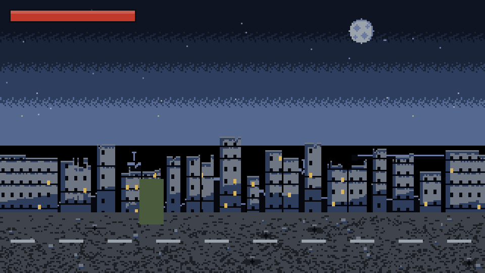
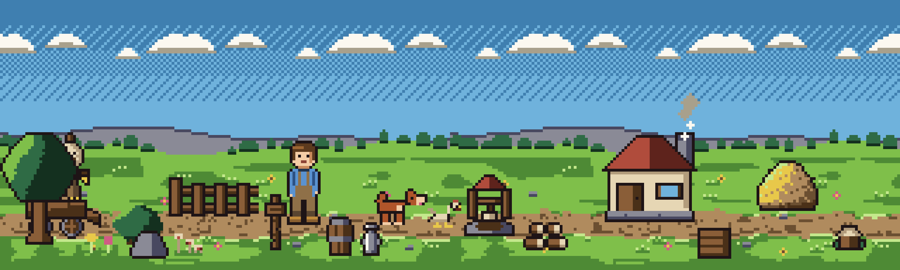

# pixellint

**An AI pixel-art generation pipeline that checks its own work.**


Every image here was generated by a model that **cannot see**. No image model is
involved. The trick is not a better generator — it is that pixel art is a
*deterministic* medium, so a pipeline can assert its own output and iterate
without ever looking at it.



A playable side-scrolling zombie shooter: parallax ruins, a survivor with a
rifle, shambling zombies, gore, casings, screen shake. Every sprite in it —
character, gun, enemies, background, muzzle flash, blood — was authored as a
text grid and verified by assertion.

Also in here:  — a
160×96 meadow loop, four layers by four agents against one locked palette.

---

## The pipeline

```
  spec (JSON)               what is in the scene, and where
        │
        ▼
  grid modules              each is a list of strings — 1 character = 1 pixel
        │
        ▼
  compose + render          assemble at the grid level; emit PNG and GIF
        │
        ▼
  check_*.py                ASSERT: structure · colour separation · animation
        │
        ▼
   fix the grid, re-run  ◄──┐
        │                   │
        └───────────────────┘   this loop is what replaces eyesight
```

The assertion layer is not the product. It is the **control system** that makes
generation possible at all: without it, a model that cannot see has no way to
tell whether its output is any good, so it can only generate once and hope.

Write the art as a grid of characters where one character is one pixel and one
index into a locked palette:

```python
SPRITE = [
    "................",  # 0
    ".....KKKKKK.....",  # 1   <- those six Ks are the six pixels of the crown
    "....KHHHHHHK....",  # 2
    "...KhhhhHHHHK...",  # 3   <- the four h's are a highlight, light from upper-left
    ...
]
```

The grid **is** the artwork — it is not exported from a drawing, it is the
drawing. That buys three things a raster workflow cannot have: it is
**diffable** (a one-pixel change is a one-character diff), **reviewable** (a
human can read the sprite in a pull request), and **assertable** — which is the
whole point, and what closes the loop.

## Readability: what the numbers actually mean

`pixelkit.report_separation` extracts every pair of colours that share an edge
anywhere in the image and classifies each one. Two things make two colours
tellable apart, and only two:

1. **a lightness edge** — either an absolute step of `0.22`, or a lightness
   **ratio** of `1.7`. The ratio matters because perception follows Weber's law:
   in a night palette, 0.05 against 0.16 is a three-fold brightness difference
   and reads instantly, while the same absolute gap higher up is barely visible.
2. **a chroma difference** of ΔE 12 (20 for anything touching the outline — an
   outline's whole job is to be an edge).

A pair that fails neither is a **hard failure**. A pair that is close but
visible is a **warning**, printed for the author to judge.

That split is the most important design decision in the repo, and it was learned
the hard way — see below.

## Animation: proven, not tuned

| assertion | requirement |
|---|---|
| loop closure | frame `N` is **pixel-identical to frame 0** — the seam cannot exist |
| head lock | the head block is byte-identical in every frame and only ever shifts by a whole row |
| ground line | the lowest pixel of every animated layer is the same row in every frame |
| foot alternation | the lifted foot alternates; it is a walk, not a bounce |
| rhythm | changed pixels per step stay within a few percent of each other |
| playability | the game is driven headlessly in Node with synthetic input (see below) |

Every animated element is designed to return to its exact starting state after
the loop length, so loop closure is arithmetic rather than luck:

```
4-frame walk        16 / 4 = 4 cycles            exact
4-frame trot        16 / 4 = 4 cycles            exact
clouds 4px/frame    16 × 4 = 64px = 1 tile width exact
4 smoke puffs       each fades out before wrap   exact
```

---

## The expensive lesson: a checker that is too strict costs more than it catches

This is the part worth reading.

The separation thresholds started high — a material floor of 32 for scene
shapes and 45 for sprites, with a companion rule that a large lightness step
still needed ΔE ≥ 25 to "confirm" it. Floors like that feel rigorous. They are
not; they are a design driver wearing a lab coat.

**Evidence 1 — thirteen art decisions, made to satisfy a number.** Across four
parallel agents, thirteen distinct colour pairs had to be *routed around* rather
than used:

| pair | ΔE | floor then | what it cost |
|---|---|---|---|
| `t`–`o` | 17.6 | 32 | no wood on the shaded roof slope |
| `a`–`C` | 10.9 | 32 | shirt blues unusable as sky gradient steps |
| `g`–`F` | 26.7 | 32 | grass shadow may never meet foliage |
| `K`–`t` | 24.7 | 28 | no two-tone fur on a 20px dog |
| `u`–`R` | 27.3 | 32 | wall shadow stops a row above the foundation |
| `R`–`A` | 27.4 | 32 | far ridge needs a 1px cap to face the sky |
| …and seven more | | | |

The sky agent's own working notes: *"`a`-`C` 10.9 and `C`-`A` 17.3 are under 32,
so the shirt blues cannot be used as intermediate ramp steps; the sky is `a`/`A`
dither only."* That is a threshold dictating composition for no visible reason.

**Evidence 2 — three spurious failures, each by a fraction of a unit.**

```
dog's pale paw vs the dirt path      dL 0.26, ΔE 24.9   rejected by 0.1
sky gradient's own two steps         ΔE 19.7            rejected by 0.3
near-black vs black                  ΔE 3.6             correctly rejected
```

A sky gradient's adjacent bands are *supposed* to be close. That is what a
gradient is. The rule was treating a smooth ramp as a defect.

**Evidence 3 — and this one is on me.** The repo's own headline war story used
to be that the check "caught a killer": outline `K` against trouser shadow `p`
at ΔE 12.7, which would supposedly merge and destroy the silhouette. Under the
rule that actually matters — lightness ratio — that pair sits at **3.2×**, which
reads perfectly well. Dark trousers with a black outline is completely standard
pixel art. **The check flagged something that was almost certainly fine, I
"fixed" the palette to satisfy it, and then cited it as the justification for
keeping the check strict.** That is circular, and it is exactly the failure mode
this section is about.

### What changed

- The two tier sets are gone. The distinction that matters is not "how big is
  the shape", it is "does this pair decide the silhouette", so the rules key off
  **role**: outline vs fill, and everything else.
- The shade/material taxonomy is gone. Base colours and their shadows are *meant*
  to sit close; they were being reported as defects.
- The lightness test is now a **ratio**, not just an absolute step, which is why
  a night palette is no longer declared unreadable.
- **Hard failures and warnings are separate.** Only unreadable pairs fail.
- `check_thresholds.py` pins the rule with synthetic cases, so a future tweak
  cannot quietly turn the check off — and it is tested against synthetic inputs
  rather than the live palette, because the live palette keeps getting fixed and
  a "regression test" that reads it stops testing anything.

Net effect on the meadow's thirteen blocked pairs: **7 now clean, 7 warnings, 2
still hard failures** — and those two (`a`–`C` at 10.9, `t`–`n` at 13.7) are
genuinely indistinguishable, which is what a hard failure should mean.

## Playability is asserted too

A game can pass every art check and still be unplayable. `game/smoke_test.mjs`
stubs the DOM and canvas in Node, loads the real script out of `index.html`,
drives it with synthetic input, and asserts: the spawner produces enemies, a
bullet travels and kills a zombie and scores, a swarm can kill the player,
nothing goes NaN over 25 simulated seconds of held input, entity counts stay
bounded, and `render()` does not throw. 12 assertions, no browser required.

## Quick start

```bash
pip install -r requirements.txt
python build.py          # render everything, then run every check
```

`build.py` runs the render steps in dependency order and then discovers every
`check_*.py` by glob, so a layer added later brings its own assertions with it.
It exits non-zero on any failure, which is what CI enforces.

```bash
python scene.py                       # build scenes/meadow.json
python export_game_atlas.py           # pack game sprites -> game/assets.js
node game/smoke_test.mjs              # play the game headlessly
```

## Playing the demo

Open `game/index.html`. It is one HTML file plus one generated JS asset file —
no server, no build step, no dependencies. `A`/`D` or arrows to move, click or
space to fire, `R` to restart, `M` to mute.

Feedback is deliberate: muzzle flash with a real light cast, ejected casings with
physics, recoil that shoves the player back, screen shake, hit flash, knockback,
a hit marker that turns red on a kill, a 30-round magazine with an audible
reload, blood spray with persistent ground decals, gib bursts with a brief
hitstop, footstep dust, a low-health vignette, and a synthesised audio set (no
audio files — WebAudio oscillators and filtered noise).

The muzzle position is **measured out of the atlas**, not hard-coded:
`export_game_atlas.py` records the rightmost opaque pixel of each sprite and the
game reads the barrel tip from that. It used to be a magic `player.x + 13`,
which put the flash two columns right and two rows above the actual barrel — a
constant that silently drifts the moment the art is redrawn, and a measured one
that cannot.

## Honest limitations

- **Not a general image generator.** The pipeline removes the *eyesight*
  requirement, not the authoring. It will not invent a character you did not
  describe. Swapping in a model that emits grids is the obvious next step and is
  not something this repo does yet.
- **Assertions verify readability, not appeal.** They cannot tell you whether the
  face looks friendly or the palette looks good.
- **A front view can only show two distinguishable foot states at 1px.** Of the
  four walk frames one pair is necessarily near-duplicate.
- **Two known palette constraints remain**, logged rather than patched because
  retuning them would invalidate already-verified art: `K`–`t` is near the
  outline floor, and `T` (wood) is the most isolated key in the meadow palette.
- **The lesson above generalises past pixel art.** When a check fails by a margin
  no eye could see, suspect the check. When a constraint has shaped a dozen
  decisions, it is no longer a check.

## Files

| file | role |
|---|---|
| `pixelkit.py` | shared palettes, the separation rule, all assertion helpers |
| `gamepalette.py` | the game's own locked palette and canvas spec |
| `scene.py` + `scenes/*.json` | spec-driven scene compositor |
| `render_sprite.py` `walk_cycle.py` | the 16×32 farmer and his walk |
| `sky.py` `ground.py` `props.py` `dog.py` | meadow layers |
| `game/player.py` `game/zombie.py` `game/background.py` `game/effects.py` | game art |
| `game/index.html` | the game |
| `export_game_atlas.py` | packs sprites into a self-contained `game/assets.js` |
| `check_*.py` | the assertion suite, discovered by glob |
| `game/smoke_test.mjs` | headless playability |
| `verify_reproducible.py` | prove committed assets match the grids, pixel for pixel |

## Roadmap

- **Model-backed grids.** Let an LLM or a diffusion model emit the grid, and use
  the assertion suite as the reward signal for iterating on it. This is the step
  that turns the pipeline into a generator.
- **More assertions.** Tileability, palette harmony across a whole asset set, and
  a silhouette-recognition test: downscale until the sprite is unrecognisable and
  check the silhouette still resolves.
- **A side-view walk.** Profile animation is where leg scissoring genuinely pays
  off, and the game already needs one.

## Context

Built with [DeepSeek Harness](https://github.com/deepseek-ai/deepseek-harness)
running `deepseek-v4-flash` — a text-only model with no image input. The
constraint is the point: the assertion suite exists because the generator could
not look at its own output.

## License

MIT

---

## 中文说明

**这不是 linter，是一条会自己质检的像素画生成管线。** 所有图都由**看不见图的模型**生成，全程无图像模型参与。

**方法论核心**：像素画是确定性媒介，所以管线能断言自己的产出，在没有眼睛的情况下迭代。**断言层不是产品，是控制系统**——没有它，看不见的模型只能生成一次然后祈祷。

**这轮最重要的改动是"把过严的检查拆掉"**，而且有硬证据：

- **13 处构图决策被一个数字逼着改**：屋顶暗坡不能有木头（ΔE 17.6 < 32）、衬衫蓝不能当天空渐变台阶（10.9）、草影不能碰树叶（26.7）、20px 的小狗不能有双色毛（24.7）……天空 agent 的工作笔记原话是"所以天空只能用 a/A 抖动"——**门槛在指挥构图**。
- **三次荒谬失败**：小狗爪子 vs 泥路 ΔE 24.9 被 25 拒绝（**差 0.1**）、天空自己的两级渐变 ΔE 19.7 被 20 拒绝（**差 0.3**）。
- **最要紧的是这个**：本仓库原来的头号"战绩"是"校验抓到了描边 `K` 与裤影 `p` 的 ΔE 12.7，会毁掉剪影"。但按真正有效的**明度比值**算，这一对是 **3.2 倍**——完全可读。深色裤子配黑描边是标准做法。**检查报了一个大概率没问题的东西，我为了满足它改了色板，然后拿它当"检查必须严格"的证据。这是循环论证。**

**改动**：取消精灵/场景两套门槛（按**角色**分级：描边 vs 填充）；取消 shade/material 分类（暗部本来就该接近）；明度判据改为**比值**（韦伯定律，夜景不再被判不可读）；**硬失败与警告分离**；用合成输入的回归测试把规则钉死。

结果：原 13 对 → **7 对干净、7 对警告、仅 2 对仍硬失败**，而那 2 对（10.9、13.7）是真正无法区分的。

**可玩性也是被断言的**：`game/smoke_test.mjs` 在 Node 里打桩 DOM，把 `index.html` 的真实脚本跑起来，用合成输入验证刷怪、子弹命中、击杀计分、玩家会被围死、25 秒无 NaN、实体数量有界、渲染不抛异常。**12 条断言，无需浏览器。**

**通用教训**：当一条检查以肉眼不可见的差距失败时，怀疑检查；当一个约束已经左右了十几处决策时，它就不再是检查了。
