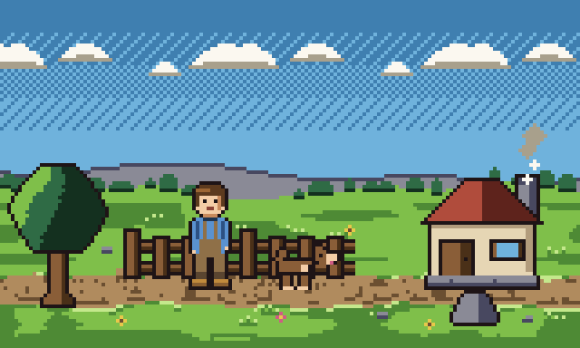

# pixellint

**An AI pixel-art generation pipeline that checks its own work.**


Every image here was generated by a model that **cannot see**. No image model is
involved. The trick is not a better generator — it is that pixel art is a
*deterministic* medium, so a pipeline can assert its own output and iterate
without ever looking at it.



A 160×96 scene: cottage, tree, fence, drifting clouds, chimney smoke, a farmer
walking and a dog trotting — 16 frames on a seamless loop. Five layers
(a backdrop, a cloud band, a ground, four props, and two animated sprites) were
authored **in parallel by four separate agents** against one locked palette, then
composited and checked. Every pixel came from a text grid.

Final state: **34 colours, 93 adjacent pairs, 0 failures; loop seam
mathematically absent.**

---

## The pipeline

```
  scenes/meadow.json        the spec: what is in the scene, and where
          │
          ▼
  grid modules              sky.py  ground.py  props.py  dog.py  walk_cycle.py
          │                 each is a list of strings — 1 character = 1 pixel
          ▼
  scene.py                  composite at the grid level, render frames + GIF
          │
          ▼
  check_*.py                ASSERT: structure · colour separation · animation
          │                 every verdict is a number, never an opinion
          ▼
   fix the grid, re-run  ◄──┐
          │                 │
          └─────────────────┘   this loop is what replaces eyesight
```

The assertion layer is not the product. It is the **control system** that makes
generation possible at all: without it, a model that cannot see has no way to
tell whether its output is any good, so it can only generate once and hope.

## How you generate art without seeing it

Write the art as a grid of characters where one character is one pixel and one
index into a locked palette:

```python
SPRITE = [
    "................",  # 0
    ".....KKKKKK.....",  # 1   <- those six Ks are the six pixels of the crown
    "....KHHHHHHK....",  # 2
    "...KhhhhHHHHK...",  # 3   <- the four h's are a highlight, light from upper-left
    ...
]
```

The grid **is** the artwork — it is not exported from a drawing, it is the
drawing. That buys the three things a raster workflow cannot have:

1. **diffable** — a one-pixel change is a one-character diff
2. **reviewable** — a human can read the sprite in a pull request
3. **assertable** — which is the whole point, and what closes the loop

## The three assertion layers

### Structure

The rendered PNG decodes back to the source grid pixel for pixel; every colour
is in the locked palette; the silhouette is a single 4-connected body with no
floating pixels; the outline is closed.

### Readability — Lab ΔE76 between colours that actually *touch*

The check extracts every pair of colours that share an edge anywhere in the
image, converts to CIELAB, and compares ΔE76 against **tiered** thresholds.
Two tiers, because the same number is wrong at two different scales:

| tier set | used for | outline | shade | material |
|---|---|---|---|---|
| `SPRITE_TIERS` | 16×32 sprites, every pixel load-bearing | 28 | 20 | 45 |
| `SCENE_TIERS` | backgrounds and props, shape carries the read | 22 | 15 | 32 |

Plus one deliberate relaxation: if two colours differ by a **luminance step of
≥ 0.25**, a ΔE of only 25 is enough. A wide value gap is itself a strong read.

### Animation

| assertion | requirement |
|---|---|
| loop closure | frame `N` is **pixel-identical to frame 0** — the loop is mathematically seamless, not hopefully seamless |
| head lock | the head block is byte-identical in every frame and only ever shifts by a whole row |
| ground line | the lowest pixel of every animated layer is the same scene row in all frames |
| foot alternation | the lifted foot alternates; it is a walk, not a bounce |
| rhythm | changed pixels per step stay within 3× of each other |

The loop-closure test is the one worth staring at. Every animated element is
designed to return to its exact starting state after `loop_frames`:

```
4-frame walk        16 / 4 = 4 cycles            exact
4-frame trot        16 / 4 = 4 cycles            exact
clouds 4px/frame    16 × 4 = 64px = 1 tile width exact
4 smoke puffs       each fades out before wrap   exact
```

So the seam is not tuned away — it cannot exist.

---

## What the checks actually caught

Five real defects, in descending order of how invisible they were.

**1. The outline was the same colour as the trouser shadow.**
`K` (outline) and `p` (trouser shadow) sat at **ΔE 12.7**. In the lower legs the
two would have merged into one dark mass, destroying the silhouette exactly
where it matters most. Rebalancing the palette brought it to 28.2. A human
eyeballing the sprite would very likely have missed this.

**2. The measurement overruled my intuition.**
The overalls are brown, the shirt is blue, and their lightness is nearly
identical (**ΔL = 0.08**). By a luminance ramp I was convinced they would read
as mud. ΔE76 said **65.4**: same lightness, wildly different hue, perfectly
legible. I was about to "fix" something that was not broken.

**3. The body-raise logic was inverted.**
```python
grid = ["................"] + grid[:-1]   # shifts the body DOWN, not up
```
This pushed the character into the floor and clipped the top of its head. A
one-pixel error, easy to miss by eye. The ground-row assertion failed instantly.

**4. Twenty-one scenery colours did not survive their own palette.**
The first scene palette had 13 failing adjacent pairs — dirt, wood, stone,
grass-shadow and foliage had all piled into the same narrow lightness band, and
the two greens were the same hue at the same value. Rebuilding it around an
explicit value ladder from 0.09 to 0.97 took it to **0 failures**. Picking
"nice" colours and checking later does not work; the ladder has to come first.

**5. CI was asserting the wrong thing.**
The reproducibility check was `git diff --exit-code -- assets` — byte equality
of generated files. Green on Windows, red on Linux, with the build itself
passing. PNG bytes differ across platforms and Pillow/zlib builds; the *pixels*
do not. Rewritten as `verify_reproducible.py`, which decodes and compares. A
pipeline that ships a bogus assertion is worth less than nothing.

**6. The check was too strict, and that cost more than it caught.**
The failure read:

```
N-S  dE=24.9  dL=0.26  need>=32 (material)  -> FAIL
```

The dirt path against the dog's pale paw. But `dL = 0.26` had already tripped
my value-step escape, which required `dE >= 25`. It missed by **one tenth of a
dE unit.** No display on earth distinguishes 24.9 from 25.

The rule was self-contradictory: it conceded that a large lightness step is a
strong edge, then demanded chroma confirm it anyway. Worse, it was *shaping the
art backwards* — the agents were designing around thresholds rather than
designing the picture. The sky agent's own notes:

> `a`-`C` 10.9 and `C`-`A` 17.3 are under 32, so the shirt blues cannot be used
> as intermediate ramp steps; the sky is `a`/`A` dither only.
> `g`-`F` 26.7 is under 32, so grass shadow never touches foliage base.

That is a constraint dictating composition for no visible reason. Fixed: the
value step now passes on lightness alone. The loosening is pinned by
`check_thresholds.py`, 12 synthetic cases, which proves the relaxed rule still
**rejects** every defect it was built for — including a pair that is 0.9 short
of its floor and 0.01 short of the step.

**7. A race, caught by CI ordering.**
The full build failed on `check_dog.py` while the dog agent was still writing
it — the check had read a half-written file. Re-running once all four agents had
settled passed cleanly. Parallel authoring is fast, but nothing may be verified
until the writer has stopped.

---

## Quick start

```bash
pip install -r requirements.txt
python build.py          # generate every asset, then run the whole suite
```

`build.py` runs the render steps in dependency order and then discovers every
`check_*.py` by glob, so a layer added later brings its own assertions with it.
It exits non-zero on any failure, which is what CI enforces.

```bash
python scene.py                      # build scenes/meadow.json
python scene.py scenes/other.json    # build a different scene
python check_scene.py                # assert over the composed scene
```

## Files

| file | role |
|---|---|
| `pixelkit.py` | the shared locked palette + all assertion helpers |
| `scenes/meadow.json` | the scene spec — declarative, no layout in code |
| `scene.py` | spec → resolve layers → composite → frames + GIF |
| `render_sprite.py` | the 16×32 farmer, authored as a grid |
| `walk_cycle.py` | the 4-frame front-facing walk |
| `sky.py` | `BACKDROP` (58×160, dithered gradient + horizon) and `CLOUD_STRIP` (12×64, seamlessly tiling) |
| `ground.py` | `GROUND` (40×160, horizontally tileable, path centred on the foot line) |
| `props.py` | `TREE` `HOUSE` `FENCE` `ROCK`, each with a documented base row |
| `dog.py` | `DOG_FRAMES`, a 4-frame trot |
| `check_sprite.py` | structure, colour separation, animation assertions |
| `check_scene.py` | scene-level assertions, including loop closure |
| `check_thresholds.py` | pins the separation rule itself, with synthetic inputs |
| `check_dog.py` `check_ground.py` `check_props.py` `check_sky.py` | per-layer assertions, written alongside each layer |
| `verify_reproducible.py` | prove committed assets match the grids, pixel for pixel |
| `build.py` | generate everything, then verify |

## Honest limitations

- **Not a general image generator.** This pipeline generates art that a human
  composed as a grid. What it removes is the *eyesight* requirement, not the
  authoring. It will not invent a character you did not describe.
- **A front view can only show two distinguishable foot states at 1px.** Of the
  four walk frames one pair is necessarily near-duplicate (`f0`/`f2` differ by
  6 pixels, an arm swing). Leg scissoring is simply not visible from the front.
- **Assertions verify readability, not appeal.** They cannot tell you whether
  the face looks friendly or the palette looks good. Those remain human calls —
  which is also why the checks are a control loop and not an oracle.
- **Palette-keyed, not AI-generated.** The pixel grids are authored, not sampled
  from a model. Swapping in an image model that emits grids is the obvious next
  step, not something this repo does yet.
- **A threshold is a claim, and a wrong one is expensive.** The suite is tuned
  per scale (`SPRITE_TIERS` vs `SCENE_TIERS`) precisely because one number
  cannot serve both, and war story 6 shows what happens when it is set a hair
  too tight: the art bends to the checker instead of the other way round. When
  a check fails by a margin no eye could see, suspect the check.
- **Two known palette constraints**, found by the agents the hard way and left
  in place rather than churned:
  - `K`–`t` (outline vs wood shadow) is **dE 24.7 against a 28 outline floor**,
    with dL only 0.12 so no value-step escape. `t` therefore cannot touch an
    outline anywhere, which is why the 20×14 dog has flat fur rather than a
    two-tone coat — cream markings carry the form instead.
  - `T` (wood) is the most isolated key in the palette: `T`–`N/n/H/h/P/p/B/b/s/u`
    all fall under the 45 material floor *with* dL < 0.25.
  Retuning `t` or `T` would work, but it would invalidate the fence, the house
  and the dog, all of which are already verified — so it is logged as a palette
  redesign rather than a patch. This is the honest shape of the tradeoff: the
  checks make every constraint visible, and a visible constraint is a decision
  you can defer instead of a bug you discover later.

## Roadmap

- **v0.2 — grid backends.** Let an LLM or a diffusion model emit the grid, and
  use the assertion suite as the reward signal for iterating on it. This is the
  step that turns the pipeline into an actual generator.
- **v0.3 — more assertions.** Tileability (do tile edges wrap?), palette harmony
  across a whole asset set, and a silhouette-recognition test: downscale until
  the sprite is unrecognisable and check the silhouette still resolves.
- **Side-view walk.** Four frames of profile animation, where leg scissoring
  genuinely pays off.

## Context

Built with [DeepSeek Harness](https://github.com/deepseek-ai/deepseek-harness)
running `deepseek-v4-flash` — a text-only model with no image input. The
constraint is the point: the assertion suite exists because the generator could
not look at its own output.

## License

MIT

---

## 中文说明

**这不是一个 linter，是一条会自己质检的像素画生成管线。**

这里所有图都是**看不见图的模型**生成的，全程没有任何图像模型参与。方法论上的关键是：**像素画是确定性媒介**，所以管线可以断言自己的产出，在没有眼睛的情况下迭代。

**管线**：`scenes/meadow.json`（声明式场景规格）→ 各图层网格模块（一个字符 = 一个像素）→ `scene.py` 合成、渲染帧和 GIF → `check_*.py` 断言 → 不合格就改网格重跑。**最后一环的闭环就是用来替代眼睛的东西。**

**断言层不是产品，是控制系统。** 没有它，一个看不见的模型只能生成一次然后祈祷。

**三层断言**：

1. **结构**——PNG 能逐像素解回源码网格、颜色不越界、剪影单一连通无悬空像素、轮廓闭合
2. **可读性**——自动提取图上**真正相邻**的每一对颜色算 Lab ΔE76，分级判定。**两套门槛**，因为同一个数字在两种尺度上是错的：`SPRITE_TIERS`（16×32 小精灵，每个像素都要扛事）描边 28 / 暗部 20 / 材质 45；`SCENE_TIERS`（背景和大件道具，形状本身承担可读性）22 / 15 / 32。外加放宽规则：明度差 ≥0.25 时 ΔE 只要 ≥25。
3. **动画**——**循环闭合（第 N 帧与第 0 帧逐像素相同，无缝是数学证明的不是调出来的）**、锁定落地行、双脚交替、节奏均匀。

**校验抓到的真实缺陷**（这部分比成果本身有价值）：

- 描边 `K` 和小腿暗色 `p` 只差 **ΔE 12.7**——小腿会跟轮廓糊成一坨。肉眼很容易漏，算一下立刻暴露。
- 背带裤棕色和上衣蓝色明度几乎一样（ΔL=0.08），我凭亮度直觉判断会糊，**测量说 ΔE 65.4 完全能读——测量推翻了我的猜测**，我差点去修一个没坏的东西。
- 抬升身体的代码方向写反了，角色被压进地里、头顶被裁掉。落地行断言当场炸出来。
- **第一版场景色板有 13 对不合格**——泥土、木头、石头、草影、树叶全挤在同一个明度带里，两种绿还是同色相同明度。按显式明度阶梯（0.09→0.97）重排后归零。**先挑"好看的颜色"再检查是行不通的，阶梯必须先行。**
- CI 原本断言 `git diff --exit-code -- assets`（字节级相等）——Windows 绿、Linux 红，而构建本身是通过的。PNG 字节跨平台天然不同，**像素才是不变的**。一条假断言比没有断言更糟。

**已知边界**：这不是通用图像生成器——它去掉的是**对眼睛的依赖**，不是创作本身，你没法让它发明一个你没描述过的角色；正面视角下 1px 只有两种可分辨的脚部状态；断言验的是可读性，验不了好不好看。

**路线图 v0.2**：让 LLM 或扩散模型直接吐网格，用断言套件当迭代的奖励信号——那一步才真正把它变成生成器。
