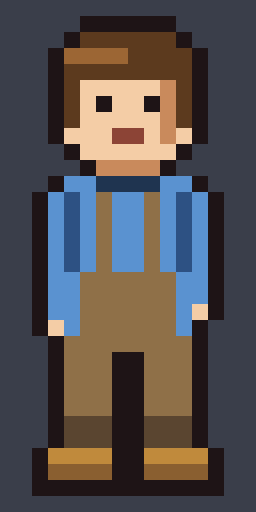

# pixellint

**Pixel art is a deterministic medium, so treat it like source code — and check it with assertions.**


A 16×32 sprite is 512 cells, each an index into a locked palette. That is small
enough to author as text and precise enough to *verify* rather than eyeball.
This repo is a worked demonstration of that claim: a 16×32 character and a
four-frame walk cycle that were drawn entirely as character grids, plus the
assertion suite that decides whether they read correctly.

The authoring agent cannot see images. Every quality claim below is a number a
script produced, not a judgement a model made.



---

## The idea

Most "AI makes pixel art" pipelines generate a raster image and hope. That
fails at exactly the point where pixel art gets hard: keeping a *silhouette*
readable and a *palette* disciplined across dozens of assets.

Inverting it works better. Write the art as a grid of characters where one
character is one pixel:

```python
SPRITE = [
    "................",  # 0
    ".....KKKKKK.....",  # 1   <- those six Ks are the six pixels of the crown
    "....KHHHHHHK....",  # 2
    "...KhhhhHHHHK...",  # 3   <- the four h's are a highlight, light from upper-left
    ...
]
```

The grid *is* the artwork — it is not exported from a drawing, it is the
drawing. That buys three things a raster workflow cannot have:

1. **It is diffable.** A one-pixel change is a one-character diff.
2. **It is reviewable.** Anyone can read the sprite in a pull request.
3. **It is testable.** Which is the whole point.

## What is verified

### Structure — `check_grid`

- the rendered PNG decodes back to the source grid, pixel for pixel
- every colour is in the locked palette
- the silhouette is a single 4-connected body with no floating pixels
- the outline is closed

### Readability — Lab ΔE76 between *touching* colours

The check extracts every pair of colours that actually share an edge somewhere
in the sprite, converts to CIELAB, and computes ΔE76 against **tiered**
thresholds:

| tier | floor | why |
|---|---|---|
| outline vs. anything it borders | **28** | an outline that merges with its fill destroys the silhouette |
| a colour vs. its own shadow | **20** | a shade ramp is *meant* to sit close to its base |
| two different materials | **45** | a shirt must never be confusable with trousers |

Plus one deliberate relaxation: if two colours differ by a **luminance step of
≥ 0.25**, a ΔE of only 25 is enough. A wide value gap is itself a strong read.

Current result: **23 adjacent pairs, 0 failures.**

### Animation — the no-jitter assertions

The single most common reason a hand-made walk cycle looks wrong is that the
head drifts a column between frames; the eye reads it as the *drawing* shaking
rather than the *character* walking. So the walk is checked like this:

| assertion | requirement | result |
|---|---|---|
| head pixels | byte-identical in all 4 frames | ok |
| head row offset | whole-row shift only, `[1, 0, 1, 0]` | ok |
| ground row | lowest pixel always row 30 | ok |
| foot alternation | `[(30,30), (29,30), (30,30), (30,29)]` | ok |
| rhythm | changed pixels per step within 2.2× of each other | `[109, 109, 109, 109]` |

That last row is the one worth staring at. Every step of the cycle changes
*exactly* the same number of pixels, which means the motion has no lurch.

---

## What the checks actually caught

Four real defects, in descending order of how invisible they were.

**1. The outline was the same colour as the trouser shadow.**
`K` (outline) and `p` (trouser shadow) sat at **ΔE 12.7**. In the lower legs,
the two would have merged into one dark mass — destroying the silhouette
exactly where it matters most. Rebalancing the whole palette brought it to 28.2.
A human eyeballing the sprite would very likely have missed this; the check
found it immediately.

**2. The measurement overruled my intuition.**
The overalls are brown and the shirt is blue with **ΔL = 0.08** — nearly
identical lightness. By a luminance ramp I was convinced they would read as
mud. ΔE76 said **65.4**: same lightness, wildly different hue, perfectly
legible. I had been about to "fix" something that was not broken.

**3. The body-raise logic was inverted.**
```python
grid = ["................"] + grid[:-1]   # shifts the body DOWN, not up
```
This pushed the character into the floor and clipped the top of its head. A
one-pixel error, easy to miss by eye. The ground-row assertion failed
instantly.

**4. The shoulders were a box.**
The silhouette went from a 6px neck straight to a 12px torso in a single row.
Fixed by making the shoulder row 10px wide with the arms flaring out on the row
below.

**5. CI was asserting the wrong thing.**
The reproducibility check was `git diff --exit-code -- assets` — byte equality
of generated files. Green locally, red on Linux, with the build itself passing.
PNG bytes differ across platforms and Pillow/zlib builds; the *pixels* do not.
Rewritten as `verify_reproducible.py`, which decodes and compares. A verification
project that ships a bogus assertion is worth less than nothing.

---

## Quick start

```bash
pip install -r requirements.txt
python build.py          # renders every asset, then runs the full suite
```

`build.py` exits non-zero on any failure, which is what CI enforces.

`verify_reproducible.py` then proves the committed assets still match the source
grids — **at the pixel level, not the byte level**. That distinction cost me a
red CI run: the first version of this check was `git diff --exit-code -- assets`,
asserting byte equality. It passed on Windows and failed on Linux while the
build itself succeeded, because PNG bytes legitimately differ between platforms
and Pillow/zlib builds even when the decoded image is identical. Asserting bytes
was simply the wrong claim. The check now decodes every asset — including every
GIF frame, plus its duration and loop flag — and compares pixels.

Individual steps:

```bash
python render_sprite.py  # idle sprite  -> assets/char_*.png
python walk_cycle.py     # walk cycle   -> assets/walk_*.png, assets/walk*.gif
python check_sprite.py   # the assertion suite
```

## Files

| file | role |
|---|---|
| `render_sprite.py` | palette + the idle sprite grid; grid → PNG |
| `walk_cycle.py` | the four walk frames, composed from shared head/torso/leg blocks |
| `check_sprite.py` | structure, colour separation, and animation assertions |
| `build.py` | render everything, then verify |
| `verify_reproducible.py` | prove the committed assets match the grids, pixel for pixel |

---

## Honest limitations

- **A front view can only show two distinguishable foot states at 1px.** So of
  the four walk frames, one pair is necessarily near-duplicate — `f0` and `f2`
  differ by just 6 pixels (an arm swing). The real choice is *which* pair to
  collapse; collapsing the contact pair buys a 44-pixel difference between the
  passing frames instead. Leg scissoring is simply not visible from the front.
- **These checks verify readability, not appeal.** They cannot tell you whether
  the face looks friendly or the palette looks good. Those remain human calls.
- **v0.1 is wired to this one sprite.** The thresholds and the ground row are
  constants tuned here, not a general tool. See the roadmap.

## Roadmap

- **v0.2 — make it a linter.** Extract the checks behind a CLI and a small
  `.grid` + palette file format so it runs on *any* sprite, not just this one.
  This is the actual point of the project.
- **v0.3 — more assertions.** Tileability (do tile edges wrap?), palette harmony
  across a whole asset set, and a silhouette-recognition test: downscale the
  sprite until it is unrecognisable, and check the silhouette still resolves.
- **Side-view walk.** Four frames of profile animation, where leg scissoring and
  arm swing genuinely pay off.

## Context

Built with [DeepSeek Harness](https://github.com/deepseek-ai/deepseek-harness)
running `deepseek-v4-flash` — a text-only model with no image input. The
constraint is the point: the verification suite exists because the author could
not look at the result.

---

## 中文说明

**这个项目的出发点**：像素画是确定性媒介。16×32 就是 512 个格子，每格是锁定调色板里的一个索引。小到可以当**源码**写，也就精确到可以**断言**而不是靠眼睛看。

所以这里的角色和走路循环不是"画"出来的，是**写成字符网格**生成的——一个字符 = 一个像素：

```python
".....KKKKKK.....",  # 头顶那 6 个像素
"...KhhhhHHHHK...",  # 左边 4 个 h 是左上方向的高光
```

这样带来的好处是：**可 diff、可 review、可测试**。第三条是关键。

**三层校验**（全部是脚本算出来的数字，不是模型的主观判断）：

1. **结构**：PNG 能逐像素解回源码网格、颜色不越界、剪影单一连通无悬空像素、轮廓闭合
2. **可读性**：自动提取图上**真正相邻**的每一对颜色，算 Lab ΔE76，按分级门槛判定——描边 ≥28、同件衣服暗部 ≥20、不同材质 ≥45；外加一条放宽规则：明度差 ≥0.25 时 ΔE 只要 ≥25 就够（大色阶本身就是强可读信号）
3. **动画**：头部像素四帧**逐字节相同**（只允许整行位移 1px）、落地行恒为第 30 行、双脚交替抬起、每步变化像素数均匀

**当前结果**：23 对相邻颜色 0 失败；头部锁定 `[1,0,1,0]`；落地行全部 30；脚步交替通过；每步变化 **109 像素，四步完全一致**。

**校验抓到的真实缺陷**（这部分比成果本身有价值）：

- 描边 `K` 和小腿暗色 `p` 只差 **ΔE 12.7**——小腿会跟轮廓糊成一坨，剪影从最关键的地方烂掉。靠肉眼很容易漏，算一下立刻暴露。
- 背带裤棕色和上衣蓝色明度几乎一样（ΔL=0.08），**我凭亮度直觉判断会糊，测量说 ΔE 65.4 完全能读**——测量推翻了我的猜测，我差点去"修"一个没坏的东西。
- 抬升身体的代码方向写反了（`[pad] + grid[:-1]` 是下移不是上抬），角色被压进地里、头顶被裁掉。落地行断言当场炸出来。

**已知边界**：正面视角下 1px 只有两种可分辨的脚部状态，所以四帧里必然有一对近似（`f0`/`f2` 只差 6 像素）；这些校验验的是**可读性**，验不了**好不好看**；v0.1 的门槛常量是针对这个精灵调的，还不是通用工具。

**路线图**：v0.2 把校验抽成 CLI + 通用 `.grid` 格式，让它能跑在**任何人自己的**像素图上——那才是这个项目真正该干的事。

## License

MIT
